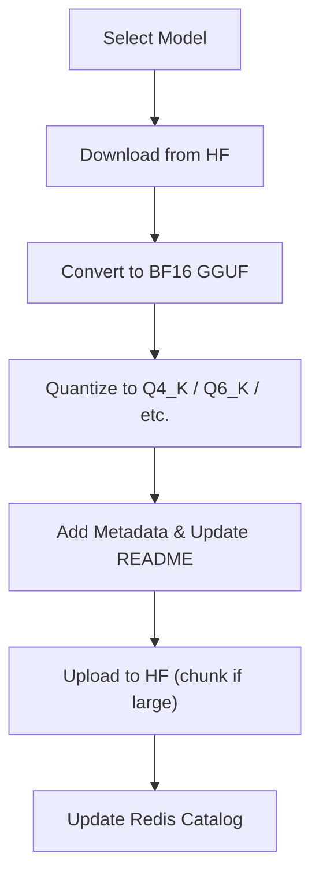

---

## GGUFModelBuilder

This codebase provides a **machine learning model conversion and management pipeline** designed to:

* Automate conversion of Hugging Face models to GGUF format (with quantization and metadata)
* Manage a Redis-based catalog of models and their metadata
* Support batch and single-model processing
* Detect new models via GitHub commit analysis
* Provide a web interface for catalog editing and search

---

# Main Components

## 1. Model Conversion Pipeline (`model_converter.py` and helpers)

* Downloads models from Hugging Face using the API
* Converts models to **GGUF format (BF16)** via `llama.cpp` scripts
* Quantizes models into various formats:

  * `Q4_K`, `IQ1_S`, `IQ3_XS`, etc.
* Adds metadata to GGUF files for compatibility and traceability
* Uploads quantized models to Hugging Face Hub (with chunking)
* Cleans up disk/cache for efficient storage
* Tracks model status in Redis:

  * Conversion attempts, successes, errors, quantizations
* Detects **Mixture-of-Experts (MoE)** models and applies special handling

## 2. Catalog Management

* Redis-based catalog storing:

  * Model metadata
  * Conversion/quantization status
* Batch support via JSON lists
* **Web UI** (`gguf-catalog-editor/app.py`) built with Flask for:

  * Searching, editing, adding, deleting
  * Import/export
  * Restore from backup

## 3. Automation & Monitoring

* `auto_build_new_models.py`:
  Watches `llama.cpp` GitHub repo for commits, analyzes them via local LLM, and updates the catalog with new models
* `build_llama.py`:
  Automates building and patching of `llama.cpp` binaries

## 4. Supporting Scripts

* `download_convert.py`: Download + convert to BF16 GGUF
* `make_files.py`: Quantize, chunk, upload, update README
* `upload-files.py`: Upload GGUF files to Hugging Face and clean up
* `add_metadata_gguf.py`: Insert/override metadata in GGUF files
* `update_readme.py`: Populate README with quantization info
* `tensor_list_builder.py`: Suggest quant strategies per tensor/layer

---

# How It Works (Typical Flow)

---

# Technologies Used

* **Python** – core language
* **llama.cpp** – model conversion and quantization
* **Hugging Face Hub** – model hosting and API
* **Redis** – catalog database
* **Flask** – web UI
* **dotenv** – configuration
* **Subprocess, threading, multiprocessing** – for tooling and parallelism

---

# Summary

* End-to-end pipeline to **convert, quantize, and upload** LLMs in GGUF format
* Redis catalog tracks **model status and metadata**
* **Web UI** for catalog browsing and editing
* Monitors GitHub to auto-detect and process new models
* Modular and scalable: Each step is handled by a distinct script/function

---

| Component | Link |
|-----------|------|
| Model Converter | [GGUF Model Converter](https://github.com/Mungert69/GGUFModelBuilder/wiki/Model-Converter) |
| Catalog Editor | [GGUF Model Catalog Editor](https://github.com/Mungert69/GGUFModelBuilder/wiki/GGUF-Model-Catalog-Editor) |

## 🌐 Community

## 🤝 Sponsors

