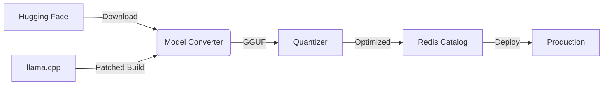

# 🚀 GGUF Model Builder

**The Ultimate Toolkit for Optimized LLM Conversion & Deployment**

[](https://opensource.org/licenses/Apache-2.0)
[](https://www.python.org/downloads/)
[](https://redis.io/)

## 🌟 Features

- **One-Click Conversion** from Hugging Face to GGUF format
- **Smart Quantization** (1-bit to 16-bit) with configurable presets
- **Redis-Powered Catalog** for enterprise-scale model management
- **Automatic Patching** of llama.cpp with custom optimizations
- **CI/CD Ready** pipelines for production deployment

## 📦 Quick Start

### Prerequisites
```bash
git clone https://github.com/yourorg/GGUFModelBuilder.git
cd GGUFModelBuilder
./install
```

### Basic Conversion
```bash
python model_converter.py
```

## 🏗️ System Architecture



| Component | Link |
|-----------|------|
| Model Converter | [GGUF Model Converter](wiki/Model-Converter) |
| Catalog Editor | [GGUF Model Catalog Editor](wiki/GGUF-Model-Catalog-Editor) |


## 🌐 Community

[](https://discord.gg/rne7YaK3)

Apache 2.0 - See [LICENSE](LICENSE)

